# Workshop Module ITS Robocon Team 2025

**Programming Division — Object Oriented Programming (OOP) dengan C++**

Modul ini membahas dasar-dasar OOP: apa itu class dan object, bagaimana cara membuatnya, dan empat pilar OOP. Semua contoh kode sudah lengkap, sehingga bisa langsung dicoba di komputer kamu.

> **Cara mencoba kode:** simpan contoh ke file, misalnya `contoh.cpp`, lalu jalankan:
>
> ```bash
> g++ contoh.cpp -o contoh
> ./contoh
> ```

## Daftar Isi

- [Workshop Module ITS Robocon Team 2025](#workshop-module-its-robocon-team-2025)
  - [Daftar Isi](#daftar-isi)
  - [1. Object Oriented Programming](#1-object-oriented-programming)
    - [Kenapa perlu OOP?](#kenapa-perlu-oop)
      - [Penerapan nyata: OOP di ROS2](#penerapan-nyata-oop-di-ros2)
      - [Masalah yang diselesaikan OOP](#masalah-yang-diselesaikan-oop)
    - [Istilah yang sering dipakai](#istilah-yang-sering-dipakai)
  - [2. Class dan Object](#2-class-dan-object)
  - [3. Attributes dan Methods](#3-attributes-dan-methods)
  - [4. Access Specifier](#4-access-specifier)
  - [5. Instantiation](#5-instantiation)
  - [6. Constructor](#6-constructor)
  - [7. Destructor](#7-destructor)
  - [8. 4 Pilar OOP](#8-4-pilar-oop)
    - [8.1 Inheritance](#81-inheritance)
    - [8.2 Polymorphism](#82-polymorphism)
      - [Function Overloading](#function-overloading)
      - [Function Overriding](#function-overriding)
    - [8.3 Encapsulation](#83-encapsulation)
    - [8.4 Abstraction](#84-abstraction)
  - [9. Ringkasan](#9-ringkasan)
  - [10. Latihan](#10-latihan)

---

## 1. Object Oriented Programming

Object-Oriented Programming (OOP) adalah cara mengatur kode agar lebih terstruktur dengan membagi program menjadi objek-objek. Objek-objek ini berisi data dan fungsi, memungkinkan kita untuk mengelola kompleksitas program dengan lebih mudah.

### Kenapa perlu OOP?

#### Penerapan nyata: OOP di ROS2

Di tim robotika, OOP bukan sekadar teori. **ROS2** (Robot Operating System 2), framework yang umum dipakai untuk memprogram robot, dirancang dengan pendekatan OOP, dan kode C++ untuk ROS2 (`rclcpp`) hampir selalu ditulis dalam bentuk class. Beberapa kebutuhan OOP di ROS2:

| Kebutuhan di ROS2 | Konsep OOP yang dipakai |
| --- | --- |
| Setiap program robot (kontrol motor, baca sensor, navigasi) dibuat sebagai **node** yang berdiri sendiri | **Class** dan **object**: satu node = satu class |
| Node mendapat kemampuan siap pakai (publisher, subscriber, timer, parameter, logger) tanpa menulis ulang | **Inheritance**: class kita mewarisi `rclcpp::Node` |
| Data node (misalnya publisher, timer, counter) tidak boleh diubah sembarangan oleh bagian lain | **Encapsulation**: member dibuat `private` |
| Pembuatan publisher, subscriber, dan timer dilakukan saat node dibuat | **Constructor** |
| Banyak node yang dijalankan bersamaan, masing-masing dengan data sendiri | Banyak **object** dari satu class |
| Fungsi `create_publisher<T>()` dipakai untuk berbagai tipe pesan | **Polymorphism** (template/overloading) |
| Kita hanya perlu memanggil `publish()` tanpa tahu cara kerja komunikasi jaringan (DDS) di belakangnya | **Abstraction** |

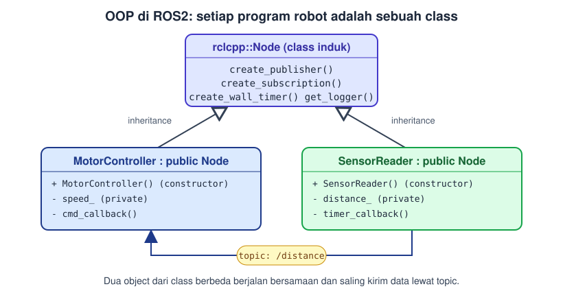

#### Masalah yang diselesaikan OOP

Bayangkan kita ingin menyimpan data dua mobil tanpa OOP:

```cpp
string brand1 = "Toyota";
string model1 = "Corolla";
int year1 = 2020;

string brand2 = "Honda";
string model2 = "Civic";
int year2 = 2021;
```

Dengan 100 mobil, kita butuh 300 variabel yang terpisah dan sulit dikelola. Dengan OOP, data yang saling berkaitan dikelompokkan menjadi satu kesatuan (object), sehingga kode lebih rapi, mudah dibaca, dan mudah dipakai ulang.

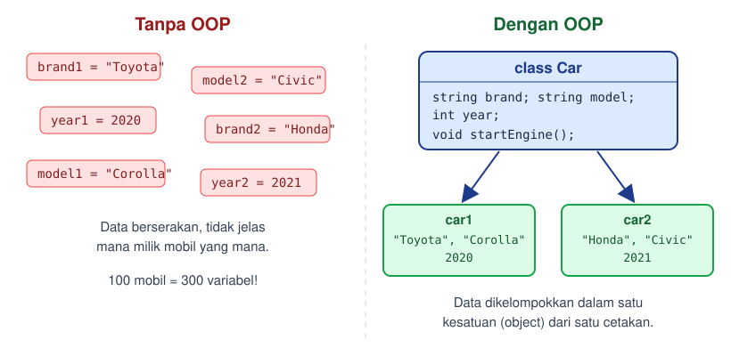

### Istilah yang sering dipakai

Beberapa istilah di OOP punya arti yang sama atau mirip. Supaya tidak bingung:

| Istilah | Arti | Padanan |
| --- | --- | --- |
| **Class** | Cetakan (blueprint) dari objek | - |
| **Object** | Hasil nyata yang dibuat dari class | instance |
| **Attribute** | Variabel milik class | property, member variable |
| **Method** | Fungsi milik class | member function |
| **Member** | Sebutan untuk attribute dan method sekaligus | - |

---

## 2. Class dan Object

Class dan Object adalah konsep dasar dalam OOP yang penting dipahami untuk mengerti cara kerja pemrograman berorientasi objek.

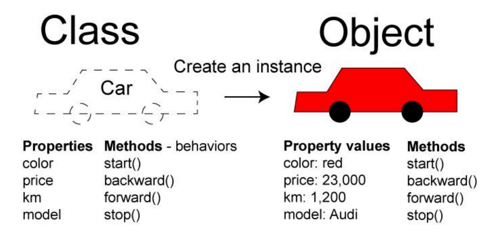

Class adalah sebuah tipe data yang bersifat user-defined, seperti Struct. Class dalam OOP ibaratnya **blueprint** dari sebuah objek. Di dalam class, kita mendefinisikan **properti (attributes) dan fungsi (methods)** yang dimiliki oleh objek.

Analogi: class `Car` adalah gambar rancangan mobil. Rancangan itu belum bisa dikendarai. Mobil yang benar-benar ada (merah, harga 23.000, model Audi) adalah **object** yang dibuat dari rancangan tersebut. Dari satu class, kita bisa membuat banyak object.

```cpp
class Car {
  public:
    // Property (variabel yang dimiliki oleh suatu objek)
    string brand;
    string model;
    int year;

    // Method (fungsi yang dimiliki oleh suatu objek)
    void startEngine() {
      cout << "The " << brand << " " << model << "'s engine is now running." << endl;
    }
};
```

> Perhatikan tanda titik koma (`;`) setelah kurung kurawal penutup class. Tanda ini wajib ada di C++.

---

## 3. Attributes dan Methods

**Attribute** adalah variabel yang dimiliki suatu Class dan **Method** adalah fungsi yang dimiliki suatu Class. Attributes dan Methods di Class juga dapat disebut sebagai **member** dari class.

Berikut adalah contoh:

```cpp
#include <iostream>
#include <string>

using namespace std;

class Mobil {
public:
    string brand;  // Attribute
    string model;
    int tahun;

    void infoMobil() {  // Method
        cout << "Brand: " << brand << endl;
        cout << "Model: " << model << endl;
        cout << "Tahun: " << tahun << endl;
    }
};

int main() {
    Mobil mobil_toyota;
    mobil_toyota.brand = "Toyota";
    mobil_toyota.model = "Avanza";
    mobil_toyota.tahun = 2019;

    mobil_toyota.infoMobil();
}
```

Output:

```
Brand: Toyota
Model: Avanza
Tahun: 2019
```

Untuk mengakses member dari sebuah object, gunakan tanda titik (`.`), seperti `mobil_toyota.brand` atau `mobil_toyota.infoMobil()`. Di dalam method, kita bisa langsung memakai attribute milik object itu (`brand`, `model`, `tahun`) tanpa perlu menuliskan nama object.

---

## 4. Access Specifier

Access Specifier mendefinisikan bagaimana member class dapat diakses di luar scope class-nya.

Ada 3 access specifier di C++, yaitu:

| Specifier | Diakses di dalam class | Diakses di luar class | Diakses oleh inherited class |
| --- | :---: | :---: | :---: |
| `public` | Ya | Ya | Ya |
| `private` | Ya | **Tidak** | **Tidak** |
| `protected` | Ya | **Tidak** | Ya |

- `public`, dapat diakses di luar class.
- `private`, tidak dapat diakses di luar class.
- `protected`, tidak dapat diakses di luar class, tetapi dapat diakses oleh inherited class (lebih di bagian [Inheritance](#81-inheritance)).

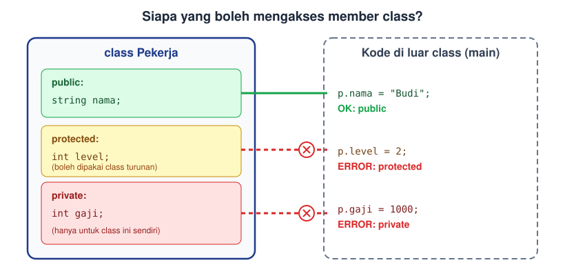

Perhatikan kode berikut:

```cpp
#include <iostream>
#include <string>

using namespace std;

class Pekerja {
public:
    string nama;
private:
    int gaji;
};

int main() {
    Pekerja pekerja1;
    pekerja1.nama = "Budi";
    pekerja1.gaji = 10000000;  // ERROR: gaji bersifat private
    cout << pekerja1.nama << endl;
    return 0;
}
```

Kode tersebut akan menyebabkan **error**, dikarenakan attribute yang di-specify sebagai `private` diakses di luar scope Class tersebut. Compiler akan menampilkan pesan seperti `'int Pekerja::gaji' is private within this context`.

> **Catatan:** jika tidak menuliskan access specifier apa pun, member di dalam `class` otomatis bersifat `private`. Jadi `public:` perlu ditulis jika ingin member bisa diakses dari luar.
>
> Lalu bagaimana cara mengisi `gaji` yang private? Jawabannya ada di bagian [Encapsulation](#83-encapsulation).

---

## 5. Instantiation

Object adalah instansi nyata dari class. Proses membuat object dari class disebut **instantiation**. Ketika sebuah object dibuat dari class, object memiliki data konkret dan dapat memanggil fungsi yang ada di class.

```cpp
#include <iostream>
#include <string>

using namespace std;

class Car {
  public:
    string brand;
    string model;
    int year;

    void startEngine() {
      cout << "The " << brand << " " << model << "'s engine is now running." << endl;
    }
};

int main() {
  // Membuat objek dari class Car
  Car car1;
  // Memasukkan variabel ke dalam objek
  car1.brand = "Toyota";
  car1.model = "Corolla";
  car1.year = 2020;
  // Memanggil method dari objek
  car1.startEngine();
  // Output: The Toyota Corolla's engine is now running.

  return 0;
}
```

Setiap object punya datanya sendiri. Jika kita membuat `Car car2;` lalu mengisinya dengan `"Honda"`, data `car1` tidak berubah.

---

## 6. Constructor

Sebuah object dapat memiliki fungsi **Constructor**. Fungsi ini adalah fungsi yang digunakan untuk membuat sebuah objek sekaligus menginputkan data ke dalam objek. Penamaan fungsi constructor harus sama dengan nama dari class, dan constructor tidak memiliki return type (bahkan bukan `void`).

Constructor dipanggil otomatis saat object dibuat. Dengan constructor, kita tidak perlu mengisi attribute satu per satu seperti pada contoh sebelumnya.

```cpp
#include <iostream>
#include <string>
using namespace std;

class Car {
  public:
    // Property (variabel yang dimiliki oleh suatu objek)
    string brand;
    string model;
    int year;
    // Constructor (fungsi yang akan dipanggil ketika objek dibuat)
    Car(string brandInput, string modelInput, int yearInput) {
      brand = brandInput;
      model = modelInput;
      year = yearInput;
    }
    // Method (fungsi yang dimiliki oleh suatu objek)
    void startEngine() {
      cout << "The " << brand << " " << model << "'s engine is now running." << endl;
    }
};

int main() {
  // Membuat objek dari class Car
  Car car1("Toyota", "Corolla", 2020);
  // Memanggil method dari objek
  car1.startEngine();
  // Output: The Toyota Corolla's engine is now running.
  return 0;
}
```

> **Perhatian:** setelah class punya constructor yang menerima parameter, kita **wajib** memberi nilai saat membuat object. Menulis `Car car1;` saja akan menyebabkan error, karena compiler tidak menemukan constructor tanpa parameter.

---

## 7. Destructor

Berkebalikan dengan constructor, destructor adalah method di dalam class yang terpanggil saat class tersebut akan dihapus. Penamaan fungsi destructor mirip dengan constructor, hanya saja terdapat simbol tilde (`~`) di depan nama dari class. Destructor tidak menerima parameter.

Destructor biasanya dipakai untuk "bersih-bersih", misalnya mengembalikan memori atau menutup koneksi/file yang dipakai object.

```cpp
#include <iostream>
using namespace std;

class Mahasiswa {
public:
    Mahasiswa() { cout << "Hallo!" << endl; }
    ~Mahasiswa() { cout << "Sampai jumpa!" << endl; }
};

int main() {
    Mahasiswa mhs;
    cout << "Semangat!" << endl;
}
```

Output:

```
Hallo!
Semangat!
Sampai jumpa!
```

Dari output tersebut, kita dapat melihat bahwa saat program dijalankan, hal pertama yang keluar adalah fungsi Constructor dari class Mahasiswa. Destructor dijalankan setelah fungsi print "Semangat!" dijalankan, karena fungsi Destructor tersebut berjalan saat akhir fungsi main, atau saat class yang dibuat dihancurkan.

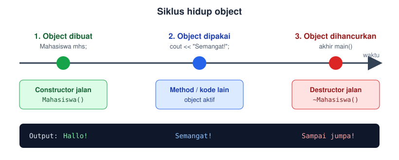

---

## 8. 4 Pilar OOP

Terdapat 4 konsep OOP yang perlu dipahami yaitu **Inheritance, Polymorphism, Encapsulation, dan Abstraction**.

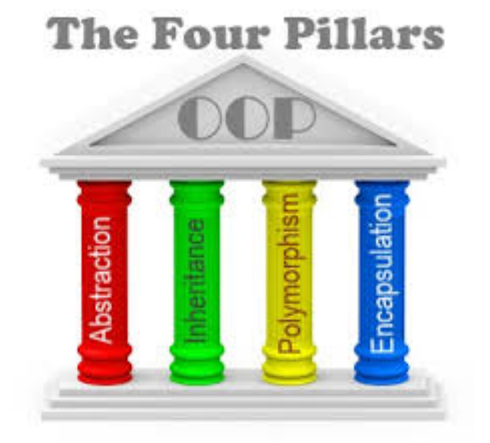

| Pilar | Intinya |
| --- | --- |
| Inheritance | Class baru mewarisi isi class lain |
| Polymorphism | Satu nama fungsi, banyak bentuk perilaku |
| Encapsulation | Menyembunyikan data, hanya buka bagian yang perlu |
| Abstraction | Menyembunyikan kerumitan, tampilkan yang relevan |

### 8.1 Inheritance

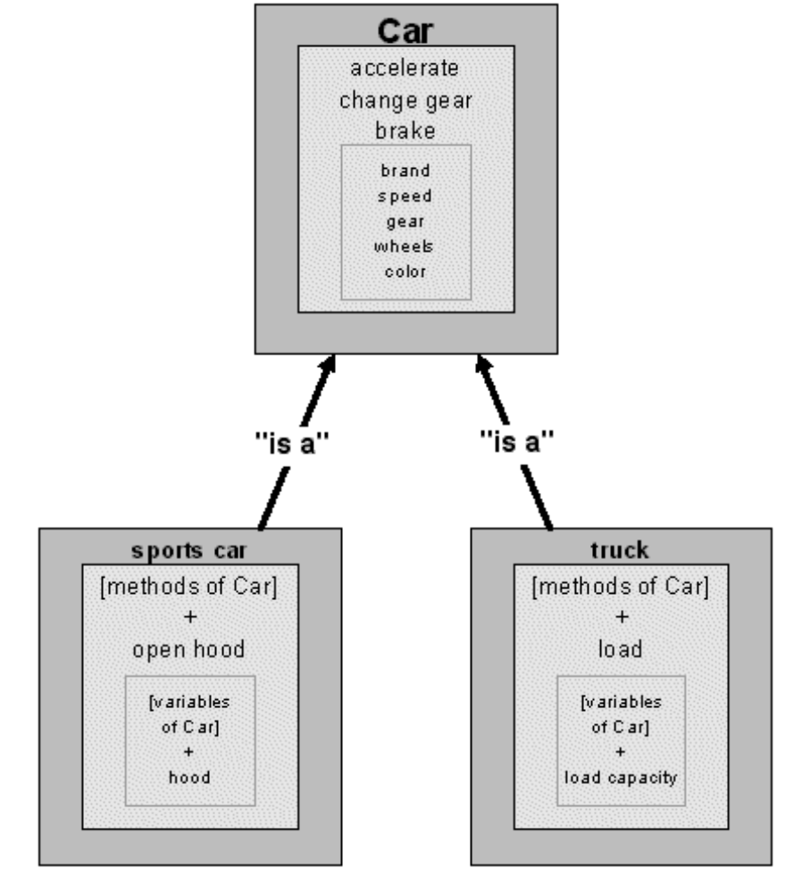

Inheritance adalah sifat OOP yang memungkinkan sebuah class mewarisi atribut dan metode lain dari class lain. Dengan inheritance, bisa dibuat sebuah class baru menggunakan atribut dan method dari class yang sudah ada, sekaligus menambahkan atau mengubah method dan atribut yang ada.

- Class yang mewarisi disebut **child class** (subclass / derived class), contoh: `Truck`.
- Class yang diwarisi disebut **parent class** (superclass / base class), contoh: `Car`.
- Hubungannya dibaca **"is a"**: sebuah `Truck` *adalah* sebuah `Car`.

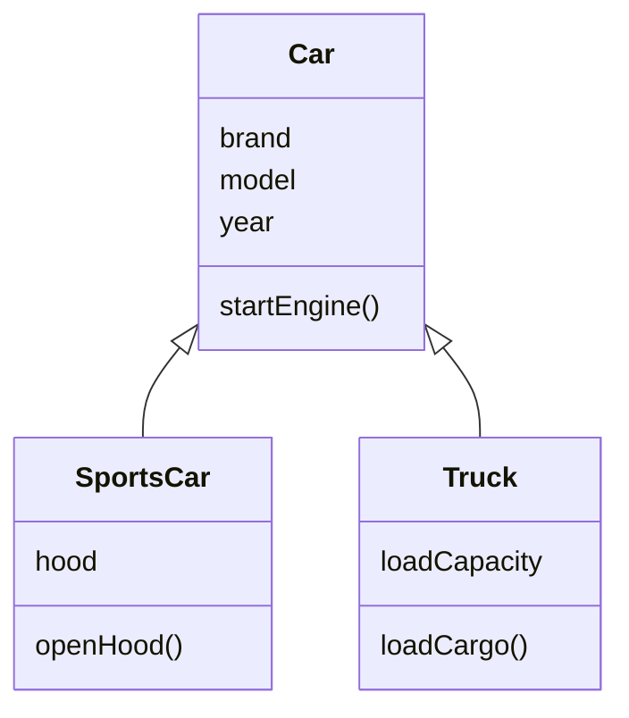

Code:

```cpp
#include <iostream>
#include <string>
using namespace std;

class Car {
  public:
    string brand;
    string model;
    int year;

    void startEngine() {
      cout << "The " << brand << " " << model << "'s engine is now running." << endl;
    }
};

// Hasil inheritance dari class Car
class Truck : public Car {
  public:
    // Tambahan property untuk Truck
    int loadCapacity;
    // New method specific to Truck
    void loadCargo(int weight) {
      if (weight <= loadCapacity) {
        cout << "The truck is loaded with " << weight << " kg of cargo." << endl;
      } else {
        cout << "The load exceeds the truck's capacity!" << endl;
      }
    }
};

int main() {
    // Create an object of Truck
    Truck truck1;
    truck1.brand = "Ford";  // Inherited from Car
    truck1.model = "F-150"; // Inherited from Car
    truck1.year = 2022;     // Inherited from Car
    truck1.loadCapacity = 3000;  // Specific to Truck

    truck1.startEngine();
    // Output: The Ford F-150's engine is now running.
    truck1.loadCargo(2500);
    // Output: The truck is loaded with 2500 kg of cargo.
    return 0;
}
```

Sintaks `class Truck : public Car` dibaca "Truck mewarisi Car". Dari sini `Truck` otomatis punya `brand`, `model`, `year`, dan `startEngine()` tanpa menulis ulang, ditambah `loadCapacity` dan `loadCargo()` miliknya sendiri.

Member `protected` pada parent bisa dipakai oleh child, tetapi tetap tidak bisa diakses dari luar (lihat [Access Specifier](#4-access-specifier)).

### 8.2 Polymorphism

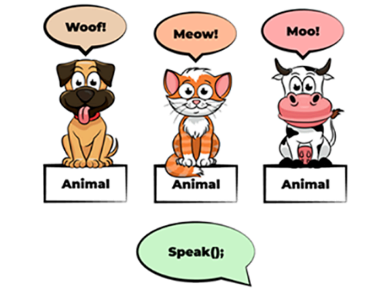

Polymorphism ("banyak bentuk") adalah salah satu konsep utama dalam Object-Oriented Programming (OOP) yang memungkinkan objek dari berbagai class untuk diperlakukan sebagai objek dari class yang sama, dengan cara yang berbeda. Dalam OOP, polymorphism memungkinkan satu fungsi, metode, atau operator untuk memiliki beberapa bentuk implementasi yang berbeda, tergantung pada objek yang memanggilnya.

Pada gambar di atas, semua hewan dipanggil dengan perintah yang sama, `speak()`, tetapi hasilnya berbeda: anjing "Woof!", kucing "Meow!", sapi "Moo!".

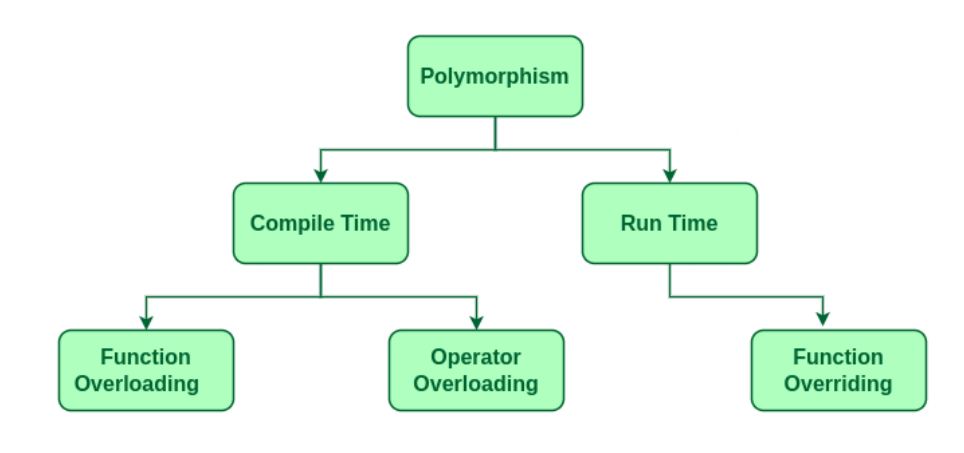

Polymorphism dibagi menjadi 2 yaitu *compile time* dan *run time*.

*Compile time* adalah polymorphism yang ditentukan ketika *compile*, yang termasuk ke *Compile time polymorphism* adalah Function Overloading dan Operator Overloading. *Run time* adalah polymorphism yang ditentukan ketika program berjalan, yang termasuk ke dalam *Run time polymorphism* adalah Function Overriding.

#### Function Overloading

Function Overloading adalah beberapa fungsi dengan nama yang sama dapat memiliki beberapa bentuk berbeda. Bentuknya dibedakan lewat **jumlah atau tipe parameter**. Compiler memilih versi yang cocok berdasarkan argumen yang diberikan.

```cpp
#include <iostream>
using namespace std;

class MathOperation {
  public:
    int add(int a, int b) {
        return a + b;
    }
    double add(double a, double b) {
        return a + b;
    }
    int add(int a, int b, int c) {
        return a + b + c;
    }
};

int main() {
  MathOperation math;
  cout << "Addition of two integers: " << math.add(5, 3) << endl;
  // Output: 8
  cout << "Addition of two doubles: " << math.add(2.5, 3.7) << endl;
  // Output: 6.2
  cout << "Addition of three integers: " << math.add(1, 2, 3) << endl;
  // Output: 6
  return 0;
}
```

> Perbedaan return type saja **tidak cukup** untuk overloading. Parameter harus berbeda.

#### Function Overriding

Function overriding adalah mengganti metode dari class induk untuk memberikan implementasi yang berbeda. Agar method bisa di-override, di class induk method ditandai `virtual`, dan di class anak ditandai `override`.

```cpp
#include <iostream>
using namespace std;

class Animal {
  public:
    virtual void sound() {
        cout << "This animal makes a sound." << endl;
    }
};

class Dog : public Animal {
  public:
    void sound() override {
        cout << "The dog barks." << endl;
    }
};

class Cat : public Animal {
  public:
    void sound() override {
        cout << "The cat meows." << endl;
    }
};

int main() {
  Animal animal;
  Dog dog;
  Cat cat;
  animal.sound();
  // Output: This animal makes a sound.
  dog.sound();
  // Output: The dog barks.
  cat.sound();
  // Output: The cat meows.
  return 0;
}
```

**Kekuatan sebenarnya dari overriding** terlihat ketika kita memakai pointer (atau reference) bertipe class induk untuk menunjuk object class anak. Program baru memutuskan versi `sound()` mana yang dijalankan saat program berjalan (*run time*), sesuai object aslinya:

```cpp
int main() {
  Dog dog;
  Cat cat;

  Animal* animals[] = { &dog, &cat };  // pointer bertipe Animal

  for (Animal* a : animals) {
    a->sound();  // versi yang jalan mengikuti object aslinya
  }
  // Output:
  // The dog barks.
  // The cat meows.
  return 0;
}
```

Tanpa kata kunci `virtual`, kedua pemanggilan di atas akan menampilkan "This animal makes a sound." karena C++ hanya melihat tipe pointer-nya.

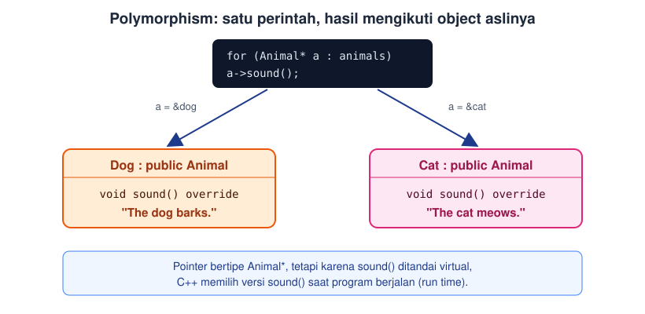

### 8.3 Encapsulation

Encapsulation adalah prinsip utama OOP yang bertujuan untuk menyembunyikan detail implementasi suatu class dan hanya mengizinkan bagian yang diperlukan untuk diakses dari luar class. Terdapat tiga *access modifiers* pada *encapsulation* yaitu:

1. `private` → hanya dapat diakses oleh kelas itu sendiri
2. `protected` → dapat diakses oleh kelas itu dan child class yang inherit terhadap kelas itu.
3. `public` → dapat diakses dari mana saja

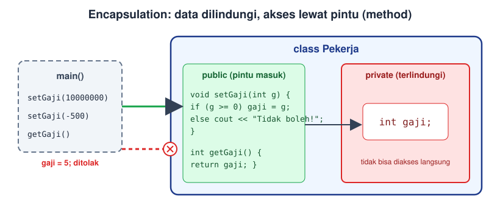

Pada praktiknya, data dibuat `private`, lalu disediakan method `public` (sering disebut **getter** dan **setter**) sebagai pintu masuk yang terkontrol. Dengan begitu, kita bisa memeriksa nilai sebelum disimpan. Ini menyelesaikan masalah `gaji` yang private pada contoh [Access Specifier](#4-access-specifier):

```cpp
#include <iostream>
#include <string>
using namespace std;

class Pekerja {
public:
    string nama;

    // Setter: mengubah nilai gaji, dengan pengecekan
    void setGaji(int gajiBaru) {
        if (gajiBaru >= 0) {
            gaji = gajiBaru;
        } else {
            cout << "Gaji tidak boleh negatif!" << endl;
        }
    }

    // Getter: membaca nilai gaji
    int getGaji() {
        return gaji;
    }

private:
    int gaji = 0;
};

int main() {
    Pekerja pekerja1;
    pekerja1.nama = "Budi";
    pekerja1.setGaji(10000000);
    cout << pekerja1.nama << " bergaji " << pekerja1.getGaji() << endl;
    // Output: Budi bergaji 10000000

    pekerja1.setGaji(-500);
    // Output: Gaji tidak boleh negatif!
    return 0;
}
```

### 8.4 Abstraction

Abstraction adalah salah satu pilar utama dari Object-Oriented Programming (OOP) yang berfokus pada menyembunyikan detail implementasi yang kompleks dan hanya memperlihatkan fitur atau informasi yang relevan kepada pengguna.

Analogi: saat mengendarai mobil, kita cukup tahu cara menginjak gas, tanpa perlu paham cara kerja mesin di dalamnya.

Contohnya pada fungsi `pow` di bawah. Saat kita melihat definisinya di library, ada implementasi yang kompleks. Namun kita tidak perlu mengetahui detail itu. Kita hanya mengetahui informasi yang relevan dengan kita: `pow(2, 3)` memberi hasil 2 pangkat 3.

```cpp
#include <iostream>
#include <math.h>
using namespace std;

int main() {
  cout << pow(2, 3) << endl;
  // Output: 8
}
```

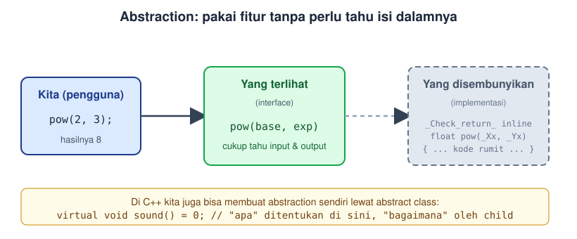

Abstraction juga bisa kita buat sendiri di C++ lewat **abstract class**, yaitu class yang memiliki method `virtual` murni (diakhiri `= 0`). Class ini hanya menentukan "apa yang harus ada", sedangkan "bagaimana caranya" diserahkan kepada child class. Abstract class tidak bisa dibuat object-nya langsung.

```cpp
#include <iostream>
using namespace std;

class Animal {
  public:
    virtual void sound() = 0;  // pure virtual: wajib diimplementasikan child
};

class Dog : public Animal {
  public:
    void sound() override {
        cout << "The dog barks." << endl;
    }
};

int main() {
  // Animal a;   // ERROR: Animal adalah abstract class
  Dog dog;
  dog.sound();
  // Output: The dog barks.
  return 0;
}
```

---

## 9. Ringkasan

- **Class** adalah blueprint, **object** adalah hasil nyata dari class.
- Class berisi **attribute** (data) dan **method** (fungsi), disebut juga **member**.
- **Access specifier**: `public` (terbuka), `private` (hanya class itu), `protected` (class itu dan child-nya).
- **Constructor** dipanggil saat object dibuat (nama sama dengan class), **destructor** (`~NamaClass`) dipanggil saat object dihancurkan.
- **Inheritance**: child mewarisi member parent (`class Child : public Parent`).
- **Polymorphism**: satu nama, banyak bentuk. *Overloading* (compile time) dan *overriding* dengan `virtual`/`override` (run time).
- **Encapsulation**: data `private`, akses lewat method `public`.
- **Abstraction**: sembunyikan kerumitan, tampilkan yang relevan.

## 10. Latihan

1. Buat class `Buku` dengan attribute `judul`, `penulis`, dan `tahun`, serta method `info()` yang mencetak semuanya. Buat dua object dan panggil `info()` pada masing-masing.
2. Tambahkan constructor pada class `Buku` agar semua attribute terisi saat object dibuat. Tambahkan juga destructor yang mencetak pesan.
3. Buat class `Rekening` dengan attribute `saldo` yang `private`. Sediakan method `setor(int)`, `tarik(int)` (tidak boleh melebihi saldo), dan `getSaldo()`.
4. Buat class `Hewan` dengan method `virtual void bersuara()`. Buat child `Ayam` dan `Sapi` yang meng-override method tersebut, lalu panggil lewat pointer `Hewan*`.
5. Buat class `Kalkulator` dengan method `kali` yang di-overload untuk dua `int`, dua `double`, dan tiga `int`.
